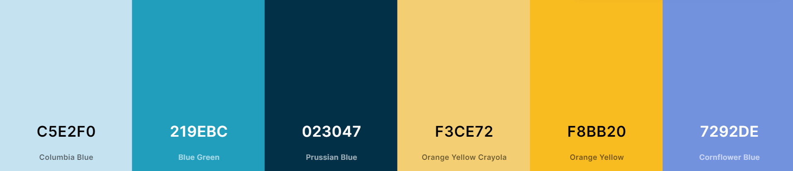

# <center>GameQuiz!</center>

* Sobre el proyecto
    * Instalación y despliegue
    * Tecnologías usadas
    * Origen
    * Objetivos
    * Concepto e inspiración 

* Retos presentados
    * setInterval
    * Textos no formateados
    * Ordenar puntuaciones
    * Extraccion y validacion de respuestas
    * Botones dinamicos
    * Sistema de puntuación

* En el tintero
* Agradecimientos
* Autores

## Sobre el proyecto

### Instalacion y despliegue <!-- FALTA SUBIR EL ENLACE -->

Para instalar esta pagina solo tienes que tener acceso a internet y ejecutar el comando en consola git clone `https://github.com/MrSetOne/Quiz.git`, tambien se puede acceder a través de este `enlace` 

### Tecnologías usadas

HTML, CSS y Javascript con la libreria [ChartJS](https://www.chartjs.org/) y la API [OpenTrivia](https://opentdb.com/api_config.php)

### Origen

Este proyecto fue planteado como un ejercicio del bootcamp [TheBridge](https://www.thebridge.tech/), consistia en genera un Quiz basandonos en JavaScript Vanilla, a excepcion de la libreria CharJs.

### Objetivos

* El Quiz constará de 10 preguntas. Cada pregunta tendrá 4 opciones y sólo una de ellas será la correcta.

* Deberán ser preguntas que vengan de https://opentdb.com/ o otras API’s que busqueis.
* La aplicación tendrá que ser una SPA (single-page application). Sólo una pregunta cada vez en pantalla.

### Concepto e inspiración

Para esta pagina teniamos la idea de realizarla con formato SPA y sin scroll, de esta forma da la sensacion mas de juego y menos de pagina web. La fuente que hemos elegido para el proyecto es la infalible [Montserrat con sus grosores del 100, 400 y 700](https://fonts.google.com/share?selection.family=Montserrat:wght@100;400;700).

La paleta de colores ha sido generada con la pagina [Coolors](https://coolors.co/) y ha sido la siguiente:


## Retos presentados

### setInterval
Para diversas funciones de este proyecto hemos tenido que investigar e implementar el metodo setInterval, el cual se encarga de ejecutar una funcion durante cada 'x' tiempo hasta que ejecutes su detención.

Ejemplo de setInterval:
```JavaScript
let intentos = 0;

let intervalo = setInterval(intentaloOtraVez, 2000)

function intentaloOtraVez() {
    console.log("¡Ahora si que si lo he entendido!")
    if (intentos == 5) {
        console.log('Vale... Soy gilipollas, porfin funciona... ( ˘︹˘ ) ')
        clearInterval(intervalo)
    } else {
        setTimeout(() => {
            console.log("Igual no lo he entendido...\n");
            intentos++;
        }, 1000);
    }
}
```

Lo complicado es la rotura del intervalo, para ello hay que ejecutar un `clarInterval(variableDelIntervalo)`, y para que vuelva a correr hay que reasignar el valor a la variable que lo contiene, usando el ejemplo de arriba sería `intervalo = setInterval(intentaloOtraVez, 2000)` sin volver a ponerle el let.

### Textos no formateados

Descargamos un API de 10 preguntas para añadir al proyecto, cuando sacamos los Datas que necesitamos algunas sintacsis no estan formateados, entonces buscamos solucion por la web, probamos con la function replace() pero solo cambia una no todos, al final usamos con innerTMHL y se formatea todos los sintacsis correctamente.

### Ordenar puntuaciones

Una de las dificultades que encontramos es como ordenar las puntuaciones, ya que el metodo `.sort` no funcionaba si querias ordenar un array de objetos, como solucion a esto generamos la siguiente funcion:
```JavaScript
function updateLeaderboard() {
    for (let i = 1; i < hotDB.length; i++) {
        if (hotDB[i].points > hotDB[(i - 1)].points) {
            hotDB.splice((i - 1), 0, hotDB[i]);
            hotDB.splice((i + 1), 1);
            i = 0;
        }
    }
}
```
A través de esta bucle de ordenan los usuarios a raiz de sus puntuaciones.

### Extraccion y validacion de respuestas

Para la extraccion y validacion de las respuestas utilizamos inputs del tipo radio, estos te obligan a seleccionar solo un elemento. Para extraer si está marcado tenemos que acceder al atributo `checked` del radio, este devuelve `true` o `false`.

### Botones dinamicos

Para los botones hemos utilizado el pseudoelemento `::after`, la popiedad `overflow:hidden` y `z-index` para que no se vean los `::after`, luego haces un hover compuesto para que se muestre el diseño que quieras. Para ver el funcionamiento de estos botones solo tienes que deshabilitar la propiedad `overflow:hidden`.

### Sistema de puntuación

Hemos generado un sistema de puntuacion que se basa en las respuestas correctas * 1000 y los segundos sobrantes * 100. De esta forma conseguimos que la puntuacion sea mas dinamica y no se reiteren las puntuaciones.

## En el tintero

Debido al plazo que hemos tenido para realizar el proyecto se han quedado algunas cosas "en el tintero", la idea es ir actualizando la pagina hasta cumplir con todos:

- [ ] Burger Menu

- [ ] Selector de dificultad

- [ ] Animaciones frontEnd

    - [ ] Transiciones entre Pages

    - [ ] Transicion de verificacion de respuestas

    - [ ] Transiciones de botones

        - [ ] Repasar botones

    - [ ] Spinner

- [ ] Refactorizar AnswersBtns

- [ ] Colocar la variante selected del nav

## Agradecimientos

Este proyecto queriamos agradecerselo a nuestra profesora [Sofia](https://github.com/SofiaPinilla) por pelearse junto a nosotros con los setIntervals y a [David](https://github.com/Dubesor22) por darme otro punto de vista para enfrentarme al temido #NaN.

## Autores

:trollface: [Michael](https://github.com/MrSetOne)

:whale2: [Shan](https://github.com/tianfanshan)